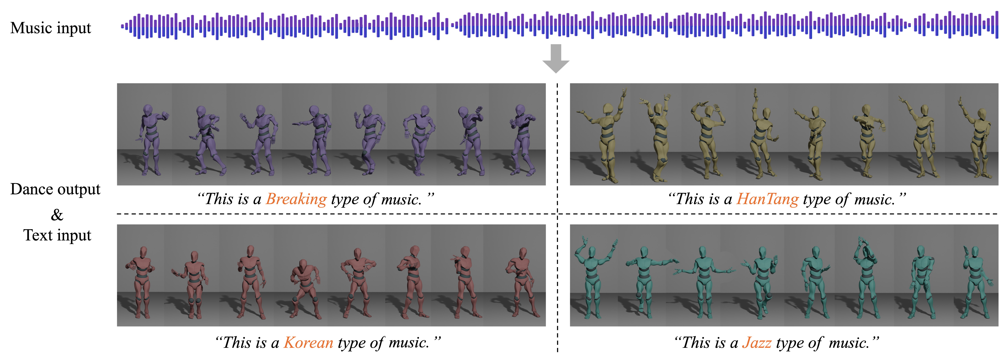

# GCDance: Genre-Controlled 3D Full Body Dance Generation Driven By Music
GCDance is a classifier-free diffusion model for generating genre-specific dance motions conditioned on both music and textual prompts. This approach enables the model to generate diverse dance styles from the same piece of music while ensuring coherence with the rhythm and melody of the music. The demos can be seen on /dance_demo.



## Data preparation

In our experiments, we use FineDance dataset for both training and evaluation. Please visit [Google Drive](https://drive.google.com/file/d/1zQvWG9I0H4U3Zrm8d_QD_ehenZvqfQfS/view?usp=sharing) to download and download the required SMPL models from [here] (https://smpl-x.is.tue.mpg.de/) into './assets'.

### Training
```python
accelerate launch train.py --wandb
```

### Generate

```python
python test.py --test_gen
```
### Evaluate

```python
python test.py --eval --type 0
```

### Visualization
```python
python vis.py --motion_save_dir 
```
