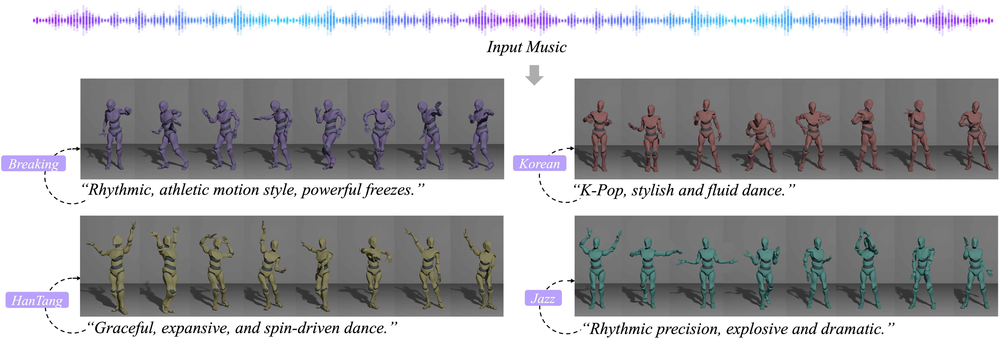

# GCDance: Genre-Controlled 3D Full Body Dance Generation Driven By Music

<div align="center">
<a href='https://xinranliu7715.github.io/gcdance/'></a> 
<a href='https://arxiv.org/abs/2502.18309'></a> 


</div>
Music-driven dance generation is a challenging task, as models must respect genre conventions, preserve physical realism, and achieve fine-grained synchronization between movement and musical beat and rhythm. Despite recent progress in music conditioned generation, many methods still struggle to express distinctive genre specific style. We present GCDance, a diffusion based framework for genre specific 3D full body dance generation conditioned on music and descriptive text. The approach introduces a text based control mechanism that converts prompts, including explicit genre labels and free form descriptions, into genre specific control signals, enabling accurate and controllable synthesis of genre consistent motion.


## Data Preparation

This project employs the **FineDance** dataset for both training and evaluation.

### 1️⃣ Download and Placement

- **FineDance Dataset**  
  Download from Google Drive and extract to `./data`:  
  [Google Drive Link](https://drive.google.com/file/d/1zQvWG9I0H4U3Zrm8d_QD_ehenZvqfQfS/view?usp=sharing)

- **SMPL Models**  
  Download required SMPL models from the official SMPL-X website and place them in `./assets`:  
  [SMPL/SMPL-X Official Site](https://smpl-x.is.tue.mpg.de/)  


- **Textual Descriptive Dataset**  
  (To be released soon)

### 2️⃣ Preprocessing

- **Motion feature extraction**
```bash
python preprocess/pre_motion.py \
  --motion_dir ./data/finedance/motion \
  --store_dir ./data/train/motion_fea319

- **Music feature extraction**
```bash
python preprocess/pre_music.py \
  --music_dir ./data/finedance/music_wav \
  --store_dir ./data/train/music


## Training

To train the model:

```python
accelerate launch train.py --wandb 
```
### Multi-Task Learning Options
We provide two multi-task optimization strategies.
Note: Aligned training requires high GPU memory (recommended: NVIDIA A100). If using smaller GPUs, reduce the batch size accordingly.

**Aligned Training**
```python
accelerate launch train.py --wandb --mtl_method Aligned
```
**Nash Training**
```python
accelerate launch train.py --wandb --mtl_method Nash
```

### Evaluation

During evaluation, 18 music tracks are segmented into multiple 120-frame clips.
For each track, 15 clips are randomly selected (totaling 270 segments) and repeated 10 times to compute the mean performance.

You may either:

- **Download preprocessed evaluation data**:  
  [Google Drive](https://drive.google.com/file/d/16gwuESFSsbyRX-vdM41ubAbMNrsGs5IC/view?usp=sharing)

or

- **Generate the evaluation segments locally**:
```bash
python test_10.py


### Generate

```python
python test.py --test_gen
```


### Visualization
```python
python vis.py --motion_save_dir 
```

## Citation

If you find this work useful, please consider citing:

```bibtex
@article{liu2025gcdance,
  title={GCDance: Genre-Controlled 3D Full Body Dance Generation Driven By Music},
  author={Liu, Xinran and Dong, Xu and Kanojia, Diptesh and Wang, Wenwu and Feng, Zhenhua},
  journal={arXiv preprint arXiv:2502.18309},
  year={2025}
}
  
## Acknowledgements
We would like to express our sincere gratitude to the EDGE and FineDance projects for their foundational datasets and research support.
